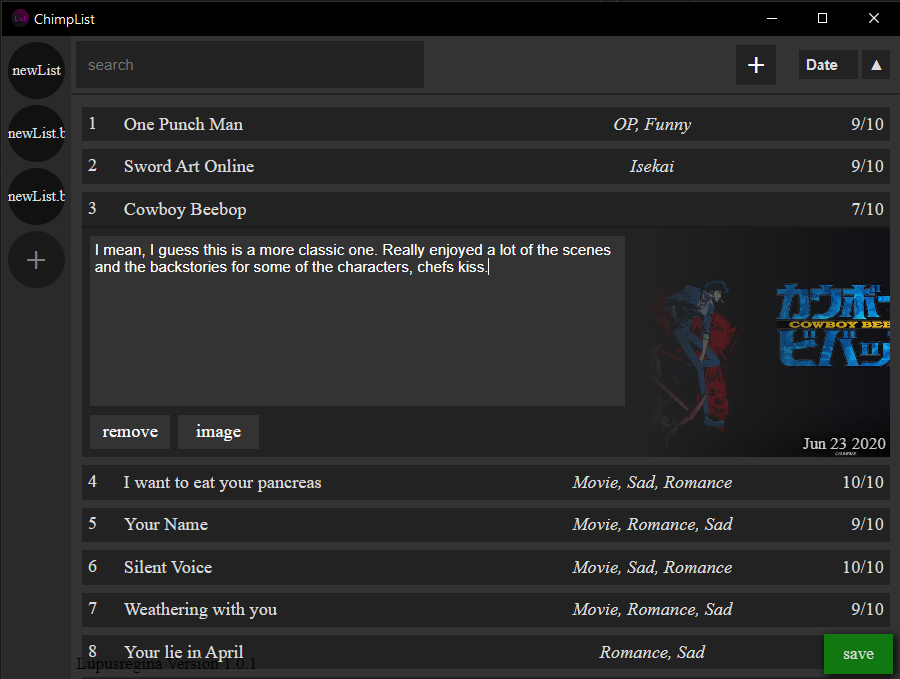
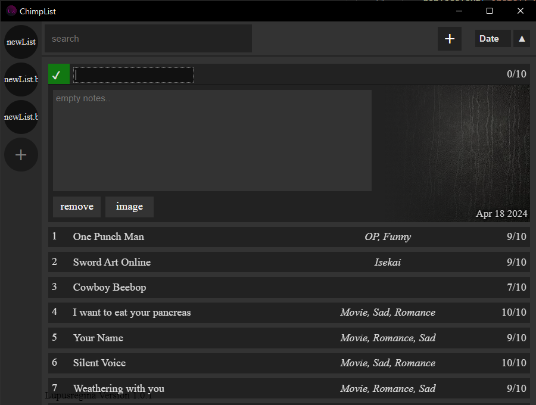
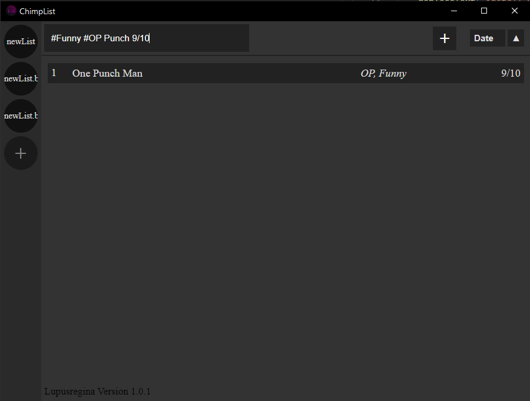

# List
An Electron App used to keep track of anything you want, with the ability to give them ratings and descriptions. The plan is to get a certification for HTTPS and host a server to contain all users lists, after that I will port it to mobile.

# BUGS / TODO
- spellcheck="true" on textarea
- maybe "=" or "+" auto adds

# Setup
- make sure node is installed
- Clone this repo
- setup .env
- run with `npm start`

# Make
- setup api process.env stuff
- package with `npm run make` (might have to do 2 lines before this)
- remove api process.env stuff

**IMPORTANT**: Before it will work use new API KEY https://console.cloud.google.com/

https://www.electronjs.org/docs/latest/tutorial/quick-start

## General Look of the application

## Creating a new list item

## Regex search results

