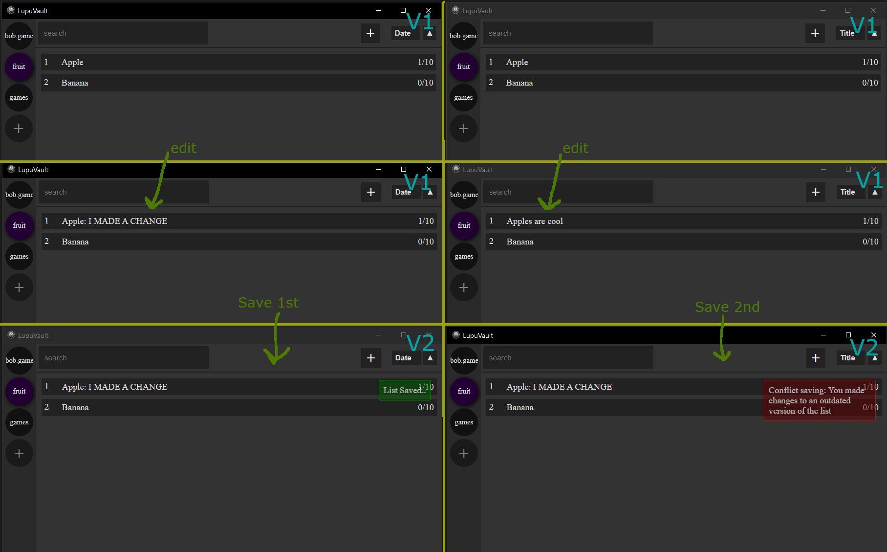
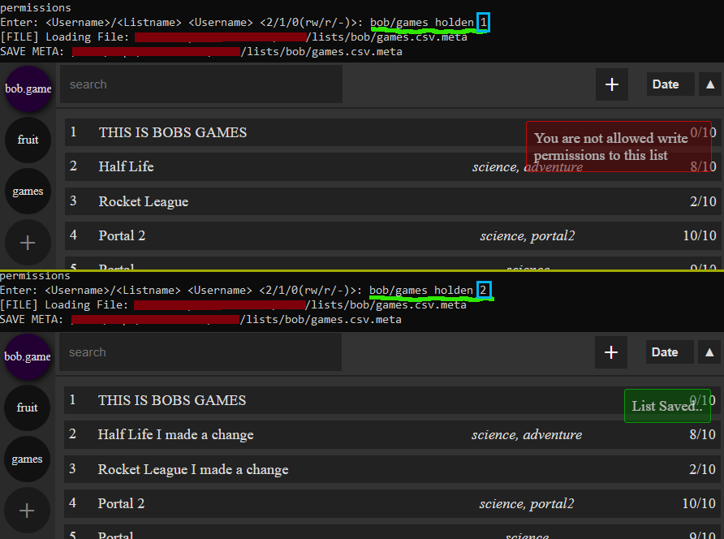

# List
An Electron App used to keep track of anything you want, with the ability to give them ratings and descriptions. The plan is to enventually port it to mobile, since I now have a server to store users lists you can find [here](https://github.com/HoldenErnest/ListServer).

# Setup
- make sure node is installed
- Clone this repo
- setup .env
- run with `npm start`

# Make
- setup api process.env stuff
- package with `npm run make` (might have to do 2 lines before this)
- remove api process.env stuff

**IMPORTANT**: Before it will work use new API KEY https://console.cloud.google.com/

https://www.electronjs.org/docs/latest/tutorial/quick-start

## General Look of the application

## Creating a new list item

## Regex search results

# Remote Hosting / Serving

## Save Conflicts (Could be Merge-Capable in the future)

## List Sharing + Permission CLI

